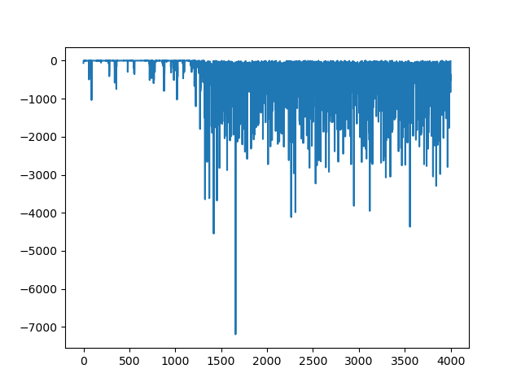
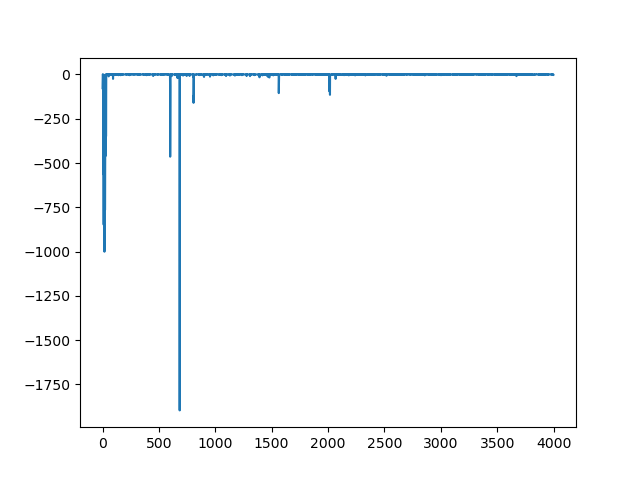

# 로그


참고 URL : 
- SARSA 코드 예제 : https://jyoondev.tistory.com/154
- Python_RL_Envs : https://github.com/jellyho/Python_RL_Envs/tree/2aab22dc93b3d2e0380080822a11e395db340c41

브랜치 : 
- feature-model-save-load : 생성 및 테스트 필요

2023.01.30
- feature-device-to 구현을 위해 기능을 적용하고 테스트하니 속도가 더 느려지는 현상을 목격했다. 그리고 아래와 같은 결론을 chatgpt를 통해서 받아낼 수 있었다.
```
GPU는 병렬 연산에 강점이 있어, 대규모 데이터셋과 복잡한 모델에서 훨씬 더 빠른 속도를 제공합니다. 
그러나 강화학습에서는 일반적으로 매 스텝마다 모델을 업데이트하고, 이는 상대적으로 작은 배치 크기를 사용합니다. 
이런 경우에는 CPU에서 GPU로의 데이터 전송 오버헤드가 상대적으로 크게 작용하여, GPU를 사용하는 것이 오히려 느려질 수 있습니다.
```
- 환경 시뮬레이션이나 복잡한 모델이 아닐 경우에는 cpu기반으로 돌려도 되겠다.
- feature-device-to 구현 완료
- git diff feature-device-to feature-device-to-comp 를 통해서 device를 반영하는 곳을 비교 분석할 수 있다.


2023.01.29
- feature-epsilon-decaying 구현 완료 

<B>구현 전(좌), 구현 후(우) </B>
<p align="center" width="100%">



</p>

2023.01.24
- 학습 중 랜덤에 따라 쑥 떨어지는 구간이 생기는 것 같다. 그냥 epsilon이 아니라 epsilon decaying을 접목시켜보자.
- 코랩에서의 모델을 저장하고 로컬에서 반영하는 기능을 테스트하는 것이 필요함.
- 학습 효율성을 위해 무거운 작업을 device에서 할 수 있도록 변경하는 것이 필요함.

2023.01.20
- dqn_torch_test01 : 내가 바로 torch로 직접 하나씩 건드려가며 코드 변환을 함. 하지만 실행자체가 되지 않음.
- dqn_torch_test02 : chatgpt를 이용하여 DQNAgent를 바로 chatgpt로 변환함. 실행은 되지만 학습이 되지 않음.

2023.01.19
- 모델의 input으로 쓰이는 것은 state이다.

2023.01.08
- 취업 및 수익 발생을 위해서는 파이토치가 유리함.
- 파이토치를 학습 후, 토치기반으로 DQN화 하면 됨.

2023.01.04
- 예제로 쓸만한 SARSA를 발견하고 로컬에서 기능을 확인함.
- SARSA를 DQN형태(뱀게임을 참고)로 변환함.
- 로컬에서도 돌아가나 colab에서 빠른 속도를 보여줌.
- 뱀게임은 텐서플로우 기반으로 구성됨.
